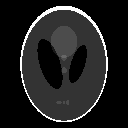
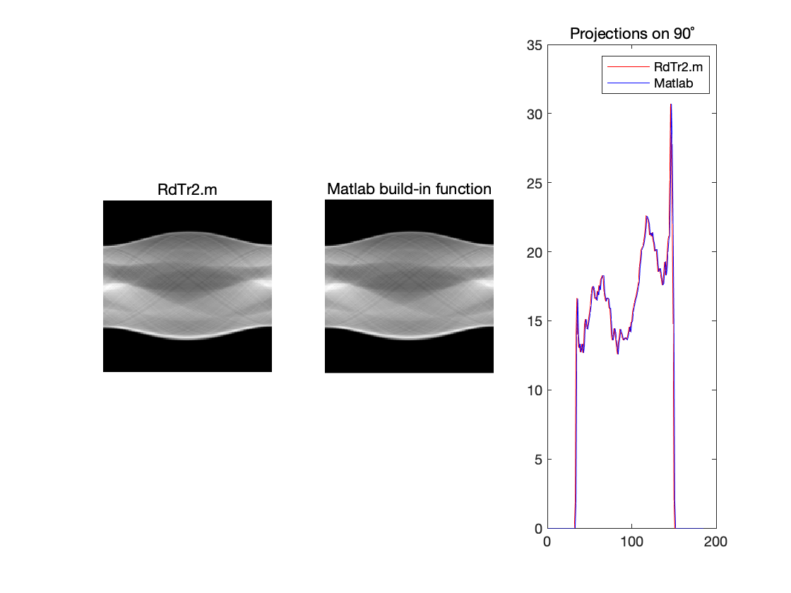
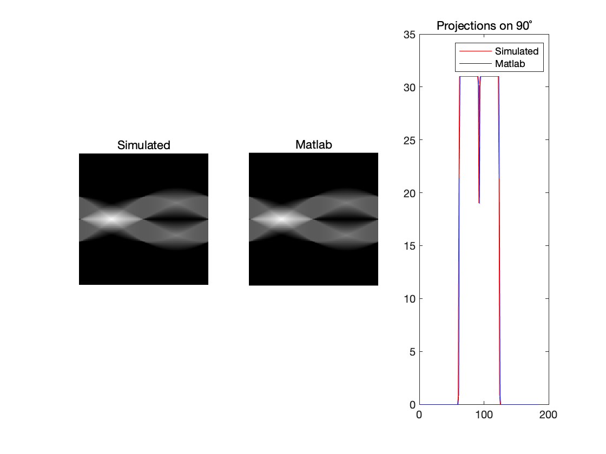
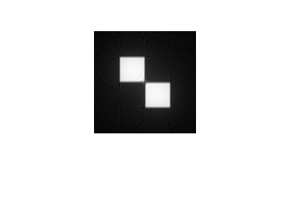
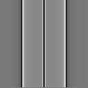
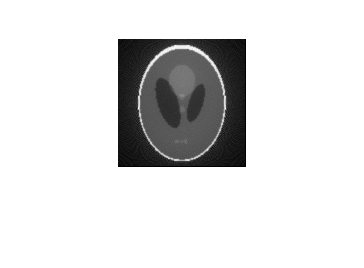

# Radon Transform and Inverse Radon Transform

# Goal 

To Generate CT raw data (sinograms) of objects and to reconstruct the tomographic images

# Source images

* 128 by 128 simulated head phantom

  

* 128 by 128 two square phantom

  

# Radon transform results

* 128 by 128 simulated head phantom

* 128 by 128 two square phantom

# Inverse Radon transform results

* 128 by 128 simulated head phantom

  Reconstruct image
 
  

  Animation over the project angle

  

* 128 by 128 two square phantom

  Reconstruct image
 
  

  Animation over the project angle

  
